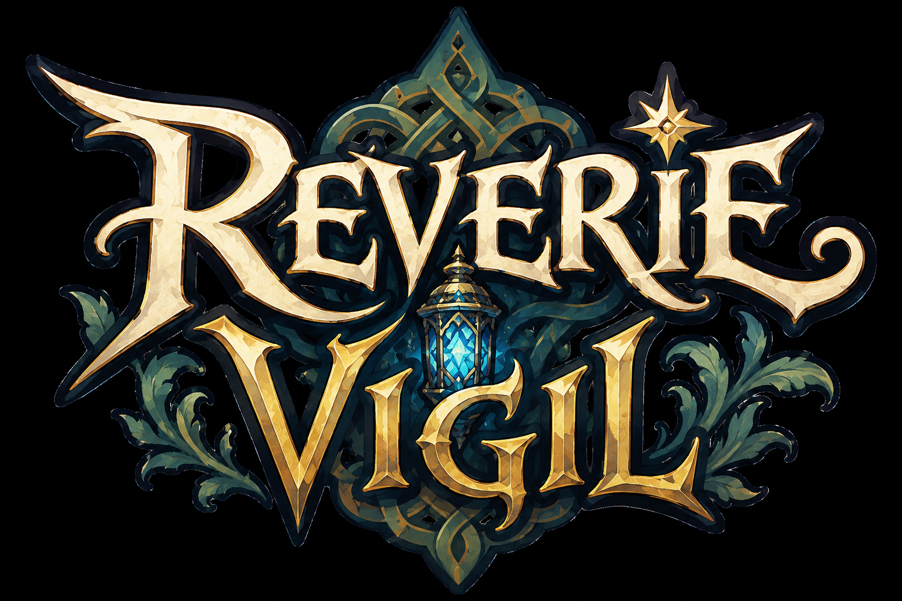

# Reverie Vigil

> A hand-drawn idle gacha RPG set in a world that is alive, dreaming, and dangerously unstable.

**Reverie Vigil** is a free-to-play idle gacha RPG. The world — **The Reverie** — dreams *too hard*: wonder curdles into excess, and its dreams become reality. You play as a **Waker**, a conscious presence whose awareness rouses **The Awake** — a cast of characters named after and shaped by coffee and tea — to keep vigil against a world that loves everything a little too much.

The game leans on three things: a hand-drawn, storybook visual identity; short story-driven **Dream Fragment** episodes as the reason to return; and a monetization model that respects the player's time — *money buys time back, never power you couldn't earn by playing.*

> 🎮 Idle gacha RPG · 🎨 Aesthetic-first, hand-drawn · 📖 Story as the core loop · ⏱️ ~10–15 min daily

<p align="center">
  
</p>

---

## Tech Stack

| Layer | Choice |
|-------|--------|
| **Engine** | [Phaser 4](https://github.com/phaserjs/phaser) — owns the game/combat canvas |
| **UI layer** | [React 19](https://github.com/facebook/react) — menus, gacha, roster, Dream Fragments (HTML/CSS) |
| **Language** | [TypeScript](https://github.com/microsoft/TypeScript) |
| **Bundler / dev server** | [Vite 6](https://github.com/vitejs/vite) |
| **Package manager** | npm |
| **E2E tests** | [Playwright](https://playwright.dev) |

**Web-first:** browser playability without a download is a hard requirement. The MVP targets PC and browser; mobile (iOS/Android) is a designed-for follow-up.

---

## Getting Started

[Node.js](https://nodejs.org) is required to install dependencies and run scripts via npm.

```bash
npm install      # install dependencies
npm run dev      # start the dev server on http://localhost:8080
```

Edit any file under `src/` and Vite will recompile and hot-reload the browser automatically.

### Available Commands

| Command | Description |
|---------|-------------|
| `npm install` | Install project dependencies |
| `npm run dev` | Launch the Vite dev server on `http://localhost:8080` |
| `npm run build` | Create a production build in the `dist` folder |
| `npm run preview` | Preview the production build locally |
| `npm run test:e2e` | Run the Playwright e2e suite (auto-starts the dev server) |
| `npm run test:e2e:headed` | Run e2e tests in a visible browser |
| `npm run test:e2e:ui` | Open the interactive Playwright runner |
| `npm run test:e2e:report` | Open the last e2e HTML report |

---

## Project Structure

| Path | Description |
|------|-------------|
| `index.html` | The HTML page that hosts the game |
| `src/` | React client source code |
| `src/main.tsx` | React entry point — bootstraps the application |
| `src/App.tsx` | Root React component |
| `src/PhaserGame.tsx` | Bridge component that initializes Phaser and connects it to React |
| `src/game/` | Game source code |
| `src/game/main.tsx` | Game entry point — Phaser configuration and startup |
| `src/game/scenes/` | Phaser scenes |
| `src/game/EventBus.ts` | Event bus for React ↔ Phaser communication |
| `public/assets/` | Static assets (art, audio) loaded by Phaser |
| `gameInfo/` | Game Design Document (GDD) and art direction — the authoritative design source |
| `graphify-out/` | Generated code map used to navigate the codebase |
| `tests/e2e/` | Playwright end-to-end tests (see `tests/e2e/README.md`) |

---

## React ↔ Phaser Bridge

Phaser owns only the game/combat canvas; React owns everything else (menus, gacha, roster, Dream Fragments). The two communicate through a lightweight event bus.

```ts
import { EventBus } from './game/EventBus';

// Emit from either side
EventBus.emit('event-name', data);

// Listen on the other
EventBus.on('event-name', (data) => {
    // react to it
});
```

`PhaserGame.tsx` initializes the game and exposes the Phaser game instance and the most recently active scene via React `forwardRef`. A Phaser scene becomes visible to React once it emits `current-scene-ready`:

```ts
class MyScene extends Phaser.Scene {
    create() {
        // build your scene...
        EventBus.emit('current-scene-ready', this);
    }
}
```

---

## Handling Assets

Vite loads assets via module `import` (bundled) or from the static `public/assets/` folder.

```ts
// Bundled — imported at the top of the file
import logoImg from './assets/logo.png';

preload() {
    this.load.image('logo', logoImg);                 // bundled asset
    this.load.image('background', 'assets/bg.png');    // static asset from public/assets
}
```

On `npm run build`, static assets are copied into `dist/assets`.

---

## Deploying

Run `npm run build` to bundle the game into the `dist` folder, then upload the **entire contents** of `dist` to any static web host.

---

## Design Reference

The **Game Design Document** in [`gameInfo/`](gameInfo/) is the authoritative source for all gameplay, mechanics, narrative, and design decisions. Always work from the highest-numbered (most recent) version.

---

*Built with [Phaser 4](https://phaser.io). Reverie Vigil © Pascal Côté. All rights reserved.*